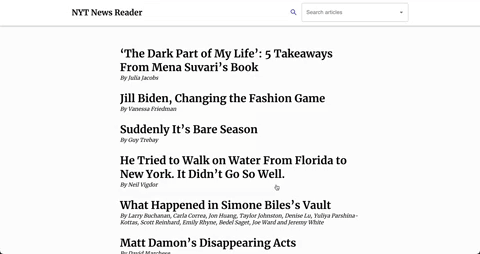

# New York Times News Reader 👓 📖

## Overview

Check out the deployed page [here](https://nyt-news-reader.surge.sh/)

This app uses the NYT Top Stories API to give users a quick glance at current popular articles. When a headline is clicked, details from that story are displayed, along with a link to read the full story on the New York Times website.

Developed for a take home technical challenge, the work on this app was strictly timeboxed to 6 hours. Building this app was an exercise in developing an MVP with a limited amount of time.

## Tech Stack

- React, React Router, React Hooks
- Material UI
- Fetch API
- NYT Top Stories API

## Installation

1. `git clone` this repo
2. `cd` into the directory and run `npm i` to install dependencies
3. run `npm start` to open the development server

*Note*: You will have to create an account & register with the [NYT Developers](https://developer.nytimes.com/) page to get an API key in order to submit API requests while developing this app. For more information on how to properly store your API key, visit [this](https://betterprogramming.pub/how-to-hide-your-api-keys-c2b952bc07e6) page.

